# Notification gateway — how it works (in plain terms)

A short guide to what the dynamics gateway does with notification events: the
happy path, how it handles errors, how the dead-letter queue (DLQ) replay works,
and why **deduplication** matters.

> Diagrams are embedded as SVG images (in [`diagrams/`](diagrams/)) so they
> display in any viewer, including the built-in editor preview. The Mermaid
> source for each is kept in a collapsible block beneath it and can be
> re-rendered with [`diagrams/README.md`](diagrams/README.md).

---

## 1. What the gateway is for

The gateway is a **relay**. The backend raises notification events; the gateway
forwards each one to **Azure Service Bus (ASB)**, where downstream (Dynamics)
picks them up.


Diagram source (Mermaid)

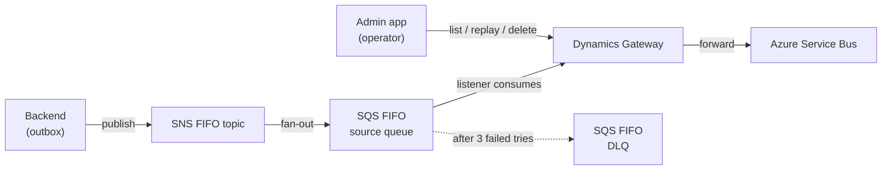

Two ids travel with every event and matter throughout:

| Id | Set by | Purpose |
|----|--------|---------|
| **`messageGroupId`** = `aggregateId` | backend | FIFO ordering — events for the same aggregate stay in order |
| **`eventId`** (also the SQS `MessageDeduplicationId`) | backend | the stable identity used to avoid processing the same event twice |

The `eventId` is carried **both** as the SQS dedup id **and** inside the message
body, so it survives even when the transport-level id is changed.

---

## 2. Happy path — one event forwarded

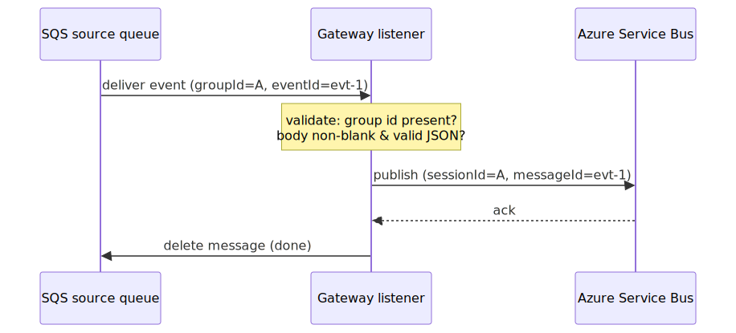

Diagram source (Mermaid)

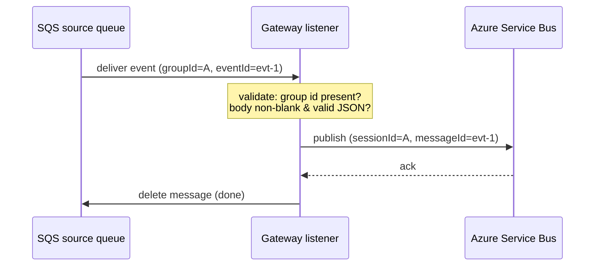

The message stays **invisible** on the queue (30s visibility timeout) while the
gateway works. On success it is deleted, so no one else sees it.

---

## 3. How errors are handled

Every ASB failure is sorted into one of two buckets. This decides whether we
**retry** or **discard**.

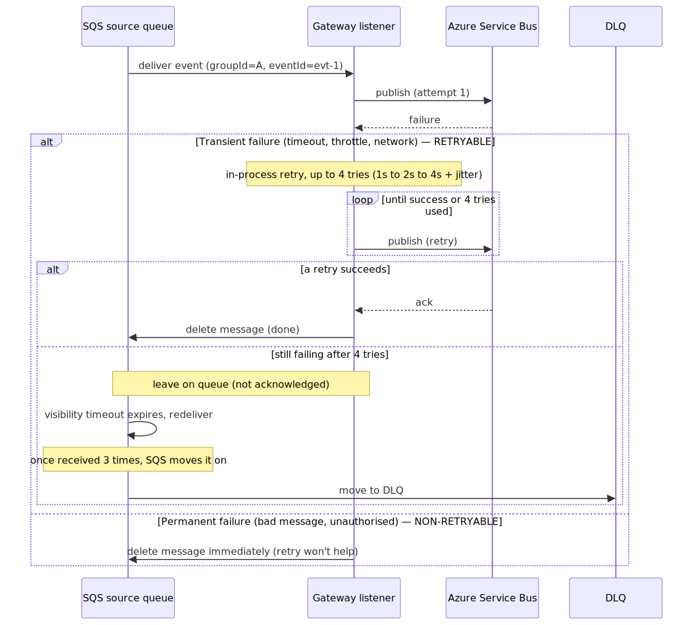

Diagram source (Mermaid)

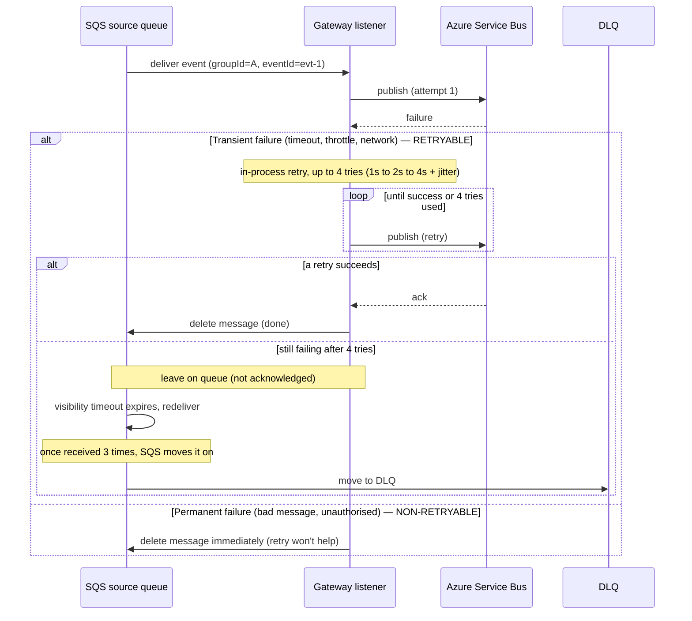

**Key rule:** the whole in-process retry window (≈7s at defaults) must stay
**shorter than the 30s visibility timeout**. If a retry outlived the timeout, the
message would reappear and a second consumer could process it at the same time —
a duplicate. A startup check enforces this.

---

## 4. Replaying from the DLQ

Once a message is on the DLQ, an operator uses the admin app to **list**,
**replay**, or **delete** it. Replay re-sends it to the source queue so the
gateway tries again.

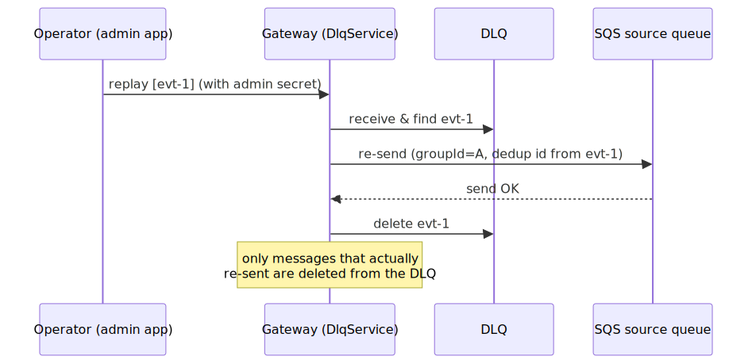

Diagram source (Mermaid)

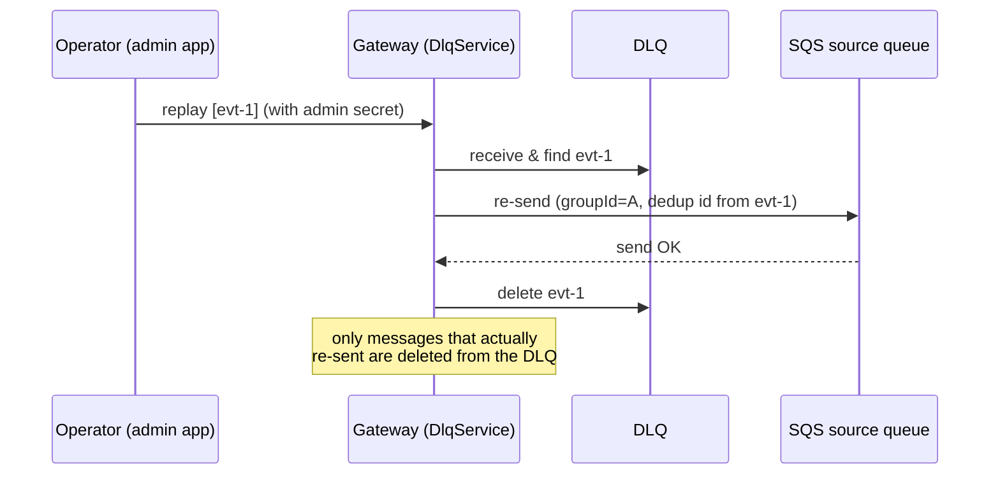

Guardrails already in place:
- **List** is read-only (no secret). **Replay/delete** require the admin secret.
- Re-send happens **before** delete, so a failed re-send leaves the message on
  the DLQ.
- Ids that can't be found in the receive window are logged and **left** for a retry.

---

## 5. Deduplication — the important bit

SQS FIFO queues **ignore a second send with the same `MessageDeduplicationId`
for 5 minutes**. This normally protects us from accidental double-sends.

### Normal case — dedup protects us

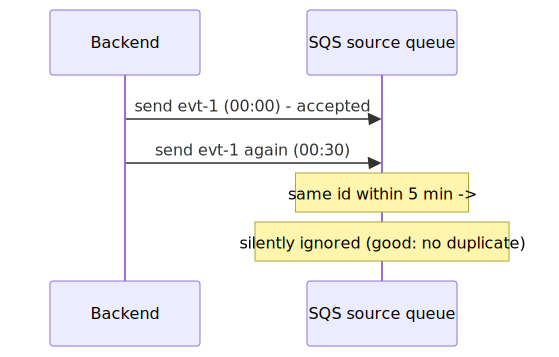

Diagram source (Mermaid)

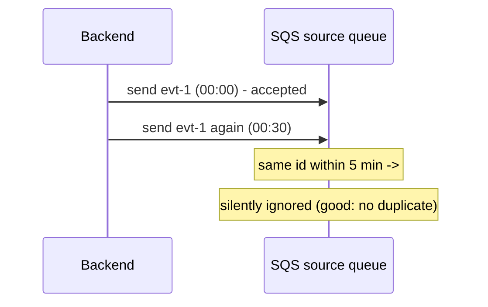

### Gotcha — replaying too soon can be silently dropped

If a message reaches the DLQ quickly (3 tries × 30s ≈ 90s) and the operator
replays **within 5 minutes of the original send**, re-sending with the *same*
`eventId` hits the still-open dedup window:

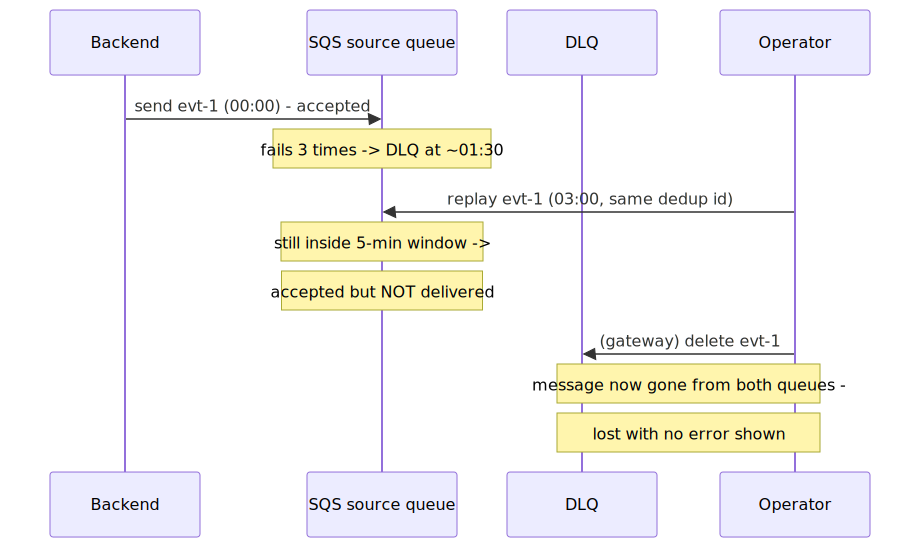

Diagram source (Mermaid)

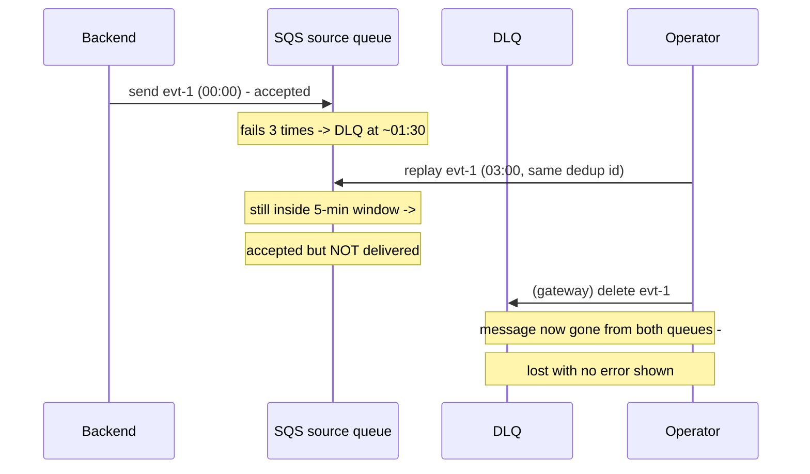

**Why the `eventId`-in-the-body matters:** the fix for this is to give the
*replay* a fresh, unique transport dedup id (so SQS always accepts it) while
keeping the **`eventId` from the body** as the ASB `messageId`. That way ordering
and cross-system dedup stay correct, but a deliberate replay is never suppressed.

---

## 6. Many events at once — FIFO ordering

Events are ordered **per `messageGroupId` (aggregate)**. Different aggregates flow
independently and in parallel; within one aggregate, a stuck message blocks the
ones behind it until it clears.


Diagram source (Mermaid)

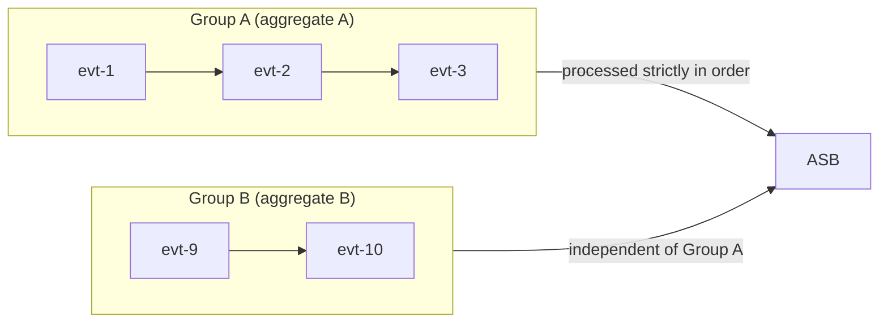

- **Group A** is delivered `evt-1`, then `evt-2`, then `evt-3` — never out of order.
- If `evt-1` keeps failing, `evt-2` and `evt-3` **wait behind it** (and eventually
  `evt-1` goes to the DLQ, unblocking the rest).
- **Group B** is unaffected by Group A — it keeps flowing.

This also explains a DLQ replay/delete quirk: if you ask to replay `evt-3` while
`evt-1` (same group, not selected) is still ahead of it on the queue, the gateway
can't reach `evt-3` yet and reports it "not found" — clear the predecessor first.

---

## In one sentence

> The gateway forwards each backend notification to Azure Service Bus in order,
> retries transient failures briefly, sends anything that keeps failing to a DLQ
> for an operator to replay, and uses the event's stable `eventId` to make sure
> the same event is never processed twice.
